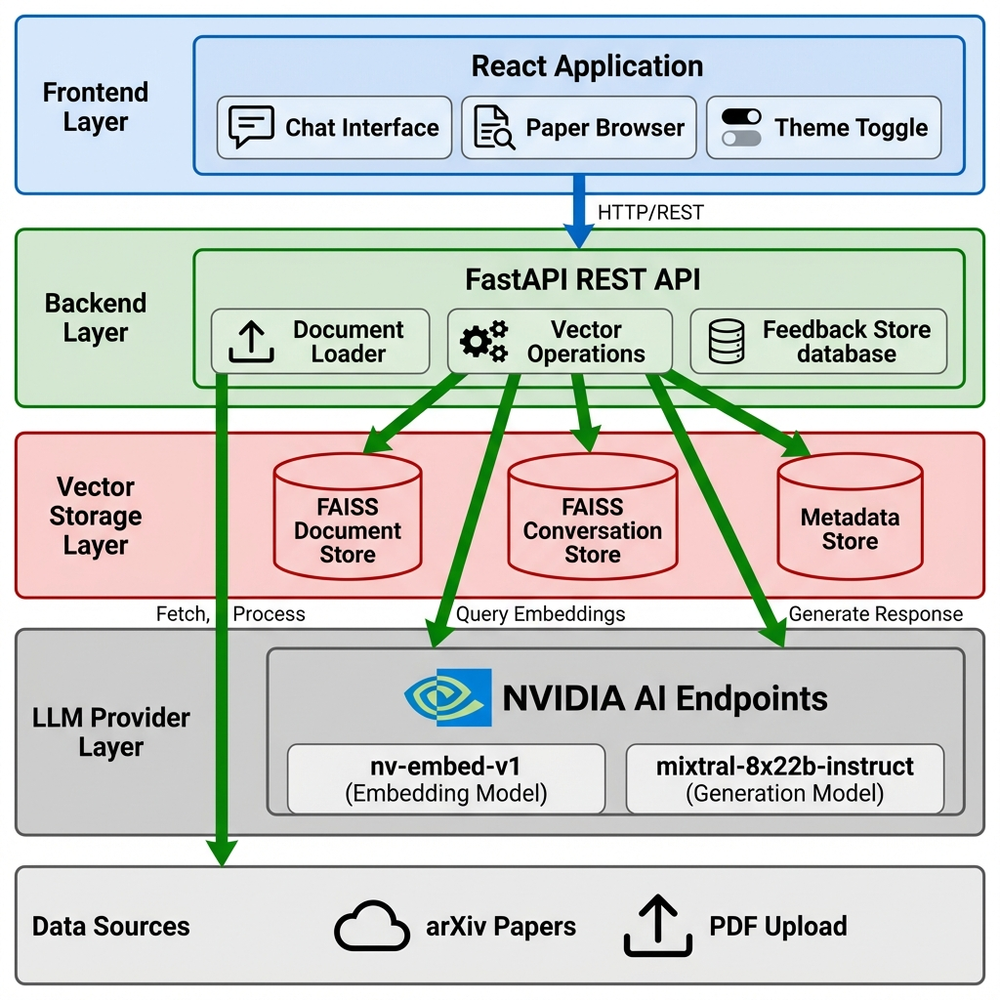
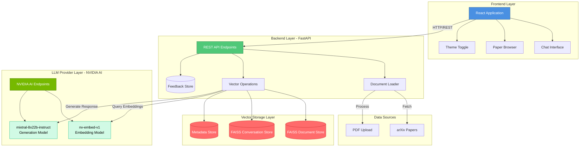
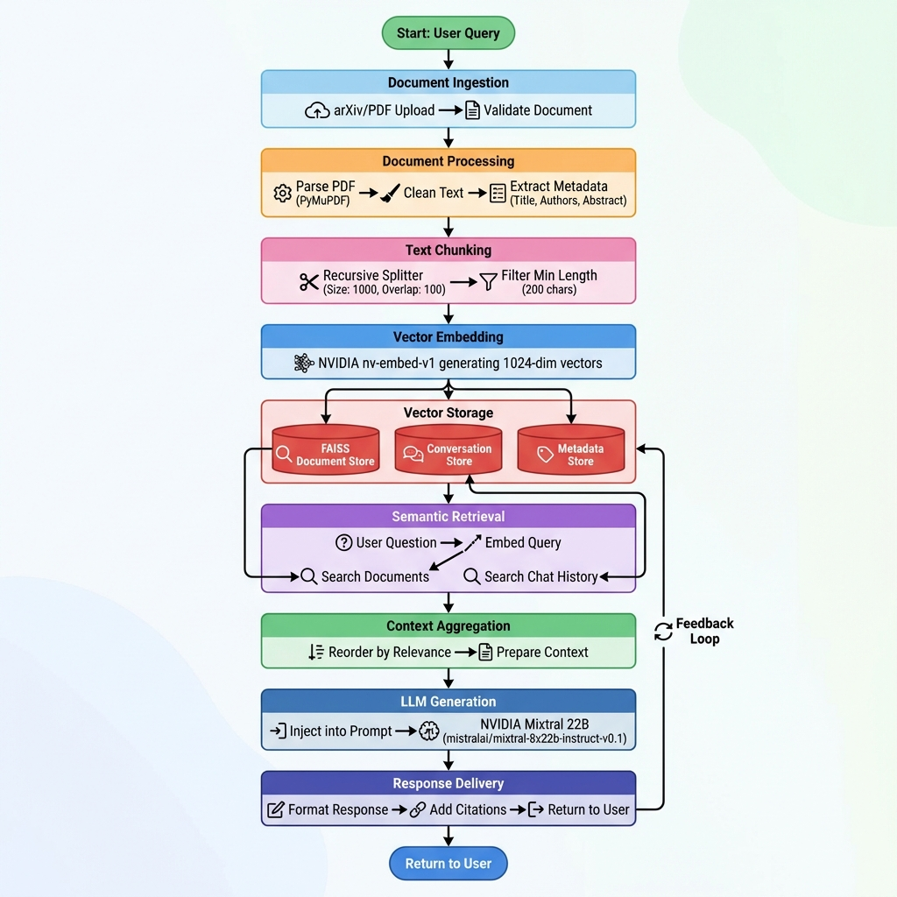
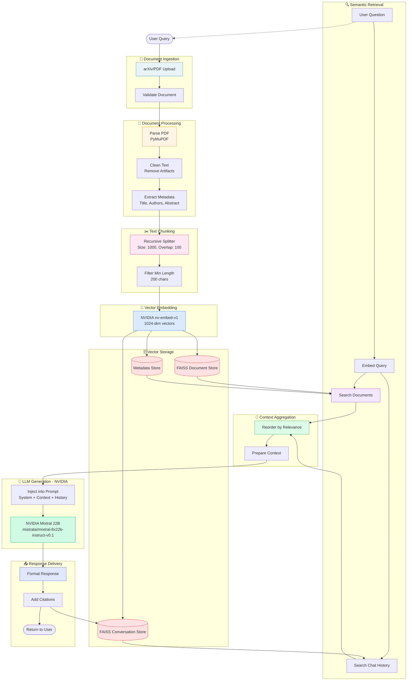

# 🤖 LLM-Powered Research Paper QA Bot

A sophisticated AI-powered question-answering system that allows users to interact with research papers through natural language queries. Built with FastAPI backend and React frontend, this application leverages NVIDIA's advanced language models for intelligent document analysis and retrieval.

## 🎥 Demo Video


*Watch the demo to see the LLM-Powered Research Paper QA Bot in action!*

## ✨ Key Features

### 🔍 **Intelligent Document Processing**
- **arXiv Paper Integration**: Automatically loads and processes research papers from arXiv
- **PDF Upload Support**: Upload and analyze custom research papers
- **Smart Chunking**: Advanced text segmentation with configurable chunk sizes and overlap
- **Vector Embeddings**: NVIDIA embedding models for semantic search capabilities

### 💬 **Advanced Q&A System**
- **Natural Language Queries**: Ask questions about papers in plain English
- **Context-Aware Responses**: AI responses based on retrieved document chunks
- **Conversation Memory**: Maintains chat history for better context
- **Source Citation**: Responses include references to specific paper sections

### 🎨 **Modern Web Interface**
- **Responsive Design**: Beautiful, mobile-friendly React interface
- **Dark/Light Theme**: Toggle between themes for comfortable reading
- **Real-time Chat**: Interactive chat interface with message history
- **Paper Management**: View, select, and manage multiple research papers

### 📊 **Analytics & Feedback**
- **User Feedback System**: Like/dislike responses to improve quality
- **Paper Statistics**: View paper metadata, chunk counts, and processing info
- **Usage Analytics**: Track interaction patterns and popular queries
- **Performance Metrics**: Monitor system performance and response quality

### 🚀 **Developer Features**
- **RESTful API**: Complete FastAPI backend with comprehensive endpoints
- **Docker Support**: Containerized deployment with docker-compose
- **Code Quality**: Automated linting with Black, flake8, and isort
- **CI/CD Pipeline**: GitHub Actions for automated testing and deployment

## 🏗️ Architecture

### System Overview



<details>
<summary>View Mermaid Diagram Code</summary>


</details>

### 🔄 End-to-End RAG Pipeline Architecture

Our implementation follows a sophisticated Retrieval-Augmented Generation (RAG) pipeline that combines document processing, vector embeddings, semantic search, and generative AI to provide intelligent question-answering capabilities.



<details>
<summary>View Mermaid Diagram Code</summary>


</details>

### 🔄 RAG Pipeline Flow Details

#### **1. Document Ingestion Phase**
- **arXiv Integration**: Automatically fetches research papers using paper IDs
- **PDF Upload**: Users can upload custom PDF documents
- **Validation**: File type and content validation
- **Metadata Extraction**: Title, authors, abstract, publication info

#### **2. Document Processing Phase**
- **PDF Parsing**: Extracts text using PyMuPDF
- **Text Cleaning**: Removes formatting artifacts, normalizes encoding
- **Content Structure**: Preserves document hierarchy and sections

#### **3. Text Chunking Phase**
- **Recursive Splitting**: Intelligent text segmentation
- **Overlap Strategy**: Maintains context continuity between chunks
- **Metadata Preservation**: Each chunk retains source information
- **Size Optimization**: Balances context length with processing efficiency

#### **4. Embedding Generation Phase**
- **NVIDIA Embeddings**: High-quality semantic vector generation
- **Batch Processing**: Efficient handling of large document sets
- **Vector Dimensions**: 1024-dimensional embeddings for rich representation

#### **5. Vector Storage Phase**
- **FAISS Integration**: Fast approximate nearest neighbor search
- **Multiple Stores**: Separate indices for documents, conversations, metadata
- **Aggregation**: Combines multiple vector collections
- **Persistence**: Maintains searchable index across sessions

#### **6. Retrieval Phase**
- **Semantic Search**: Finds relevant content based on query meaning
- **Multi-Source Retrieval**: Searches documents, chat history, and metadata
- **Relevance Scoring**: Ranks results by semantic similarity
- **Context Window**: Retrieves optimal number of relevant chunks

#### **7. Context Aggregation Phase**
- **Smart Reordering**: Prioritizes most relevant content
- **Context Integration**: Combines document and conversation context
- **Source Preparation**: Prepares citation information
- **Length Optimization**: Balances context richness with token limits

#### **8. Generation Phase**
- **Prompt Engineering**: Structured prompts with context injection
- **LLM Processing**: NVIDIA Mixtral model generates responses
- **Instruction Following**: Adheres to conversation and citation requirements
- **Quality Assurance**: Ensures responses are grounded in retrieved content

#### **9. Response Delivery Phase**
- **Content Formatting**: Structures response for frontend consumption
- **Source Attribution**: Includes paper references and citations
- **Error Handling**: Graceful failure management
- **Analytics**: Tracks usage patterns and response quality

### 🎯 Key RAG Pipeline Features

- **Dual Retrieval**: Searches both document content and conversation history
- **Context Preservation**: Maintains conversation context across interactions
- **Source Citation**: Always provides references to source materials
- **Real-time Processing**: Handles queries with sub-second response times
- **Scalable Architecture**: Supports multiple papers and concurrent users
- **Quality Assurance**: Validates responses against source documents

## 🛠️ Technology Stack

### Backend
- **FastAPI**: Modern, fast web framework for building APIs
- **LangChain**: Framework for developing applications with LLMs
- **FAISS**: Efficient similarity search and clustering
- **NVIDIA AI Endpoints**: Advanced language models and embeddings
- **PyMuPDF**: PDF document processing
- **SQLite**: Local data storage for feedback and metadata

### Frontend
- **React 18**: Modern JavaScript library for building user interfaces
- **Material-UI**: Comprehensive React component library
- **Axios**: HTTP client for API communication
- **React Markdown**: Markdown rendering for AI responses

### DevOps & Quality
- **Docker**: Containerization for consistent deployment
- **GitHub Actions**: CI/CD pipeline with automated linting
- **Black**: Python code formatter
- **flake8**: Python style guide enforcement
- **isort**: Import statement sorting

## 🚀 Quick Start

### Prerequisites
- Python 3.9+
- Node.js 18+
- Docker & Docker Compose
- NVIDIA API Key

### 1. Clone the Repository
   ```bash
git clone https://github.com/yourusername/LLM-Powered-Research-Paper-QA-Bot.git
cd LLM-Powered-Research-Paper-QA-Bot
   ```

### 2. Environment Setup
Create a `.env` file in the project root:
   ```bash
   NVIDIA_API_KEY=your_nvidia_api_key_here
   ```

### 3. Docker Deployment (Recommended)
   ```bash
# Start all services
   docker-compose up --build

# Access the application
# Frontend: http://localhost:3000
# Backend API: http://localhost:8000
# API Documentation: http://localhost:8000/docs
```

### 4. Manual Setup (Development)

#### Backend Setup
```bash
cd backend
python -m venv venv
source venv/bin/activate  # On Windows: venv\Scripts\activate
pip install -r requirements.txt
uvicorn main:app --reload --host 0.0.0.0 --port 8000
```

#### Frontend Setup
   ```bash
cd frontend
npm install
npm start
```

## 📖 Usage Guide

### 1. **Paper Selection**
- Browse available research papers in the sidebar
- Upload custom PDF documents
- View paper details and metadata

### 2. **Asking Questions**
- Type natural language questions about the papers
- Get AI-powered responses with source citations
- View conversation history

### 3. **Feedback System**
- Like or dislike responses to improve quality
- View feedback statistics
- Help train the system for better responses

### 4. **Paper Management**
- Switch between different papers
- View paper statistics and processing info
- Manage uploaded documents

## 🔧 Configuration

### Backend Configuration (`backend/config/settings.py`)

```python
# AI Models
EMBEDDING_MODEL = "nvidia/nv-embed-v1"
LLM_MODEL = "mistralai/mixtral-8x22b-instruct-v0.1"

# Document Processing
CHUNK_SIZE = 1000
CHUNK_OVERLAP = 100
MIN_CHUNK_LENGTH = 200

# Paper Sources
PAPER_IDS = [
    "1706.03762",  # Attention Is All You Need
    # Add more arXiv paper IDs
]
```

### Frontend Configuration
- API endpoint configuration in `src/App.js`
- Theme customization in Material-UI theme provider
- Component styling and layout adjustments

## 📡 API Endpoints

### Core Endpoints
- `GET /papers` - List available papers
- `POST /upload` - Upload PDF documents
- `POST /chat` - Send chat messages
- `GET /papers/{paper_id}/stats` - Get paper statistics
- `POST /feedback` - Submit user feedback

### Documentation
- Interactive API docs: `http://localhost:8000/docs`
- ReDoc documentation: `http://localhost:8000/redoc`

## 🧪 Development

### Code Quality
```bash
# Run linting
cd backend
python -m black .
python -m flake8 .
python -m isort .

# Run tests
python -m pytest tests/
```

### Adding New Features
1. **Backend**: Add new endpoints in `main.py`
2. **Frontend**: Create components in `src/components/`
3. **Styling**: Use Material-UI theme system
4. **Testing**: Add tests in `tests/` directory

## 📁 Project Structure

```
.
|-- assets/
|   |-- ResearchpaperDemo.gif
|   |-- rag_pipeline.png
|   `-- system_architecture.png
|-- backend/
|   |-- src/
|   |   |-- data/              # Document loading and processing
|   |   |-- embedding/         # Vector embeddings
|   |   |-- prompts/           # Chat prompt templates
|   |   |-- retrieval/         # Vector search and retrieval
|   |   `-- utils/             # Utility functions
|   |-- config/                # Configuration settings
|   |-- tests/                 # Test files
|   `-- main.py                # FastAPI application
|-- frontend/
|   |-- src/
|   |   |-- components/        # React components
|   |   `-- hooks/             # Custom React hooks
|   `-- public/                # Static assets
|-- .github/
|   `-- workflows/             # CI/CD configuration
|-- docker-compose.yml         # Docker services
|-- Dockerfile                 # Multi-stage Docker build
`-- README.md                  # This file
```


## 🤝 Contributing

1. Fork the repository
2. Create a feature branch (`git checkout -b feature/amazing-feature`)
3. Commit your changes (`git commit -m 'Add amazing feature'`)
4. Push to the branch (`git push origin feature/amazing-feature`)
5. Open a Pull Request

### Development Guidelines
- Follow PEP 8 for Python code
- Use TypeScript for React components
- Write tests for new features
- Update documentation as needed

## 📄 License

This project is licensed under the MIT License - see the [LICENSE](LICENSE) file for details.

## 🙏 Acknowledgments

- **NVIDIA**: For providing advanced AI models and embeddings
- **LangChain**: For the comprehensive LLM framework
- **FastAPI**: For the excellent Python web framework
- **React & Material-UI**: For the modern frontend components
- **arXiv**: For providing access to research papers

## 📞 Support

- **Issues**: [GitHub Issues](https://github.com/yourusername/LLM-Powered-Research-Paper-QA-Bot/issues)
- **Discussions**: [GitHub Discussions](https://github.com/yourusername/LLM-Powered-Research-Paper-QA-Bot/discussions)
- **Documentation**: [Wiki](https://github.com/yourusername/LLM-Powered-Research-Paper-QA-Bot/wiki)

## 🔮 Roadmap

### Upcoming Features
- [ ] **Multi-language Support**: Support for papers in different languages
- [ ] **Advanced Analytics**: Detailed usage analytics and insights
- [ ] **Paper Recommendations**: AI-powered paper suggestions
- [ ] **Export Functionality**: Export conversations and analysis
- [ ] **Collaborative Features**: Share papers and discussions
- [ ] **Mobile App**: Native mobile application
- [ ] **Plugin System**: Extensible plugin architecture

### Performance Improvements
- [ ] **Caching System**: Redis-based response caching
- [ ] **Load Balancing**: Horizontal scaling support
- [ ] **Database Optimization**: PostgreSQL migration
- [ ] **CDN Integration**: Static asset optimization

---

**Built with ❤️ for the research community**